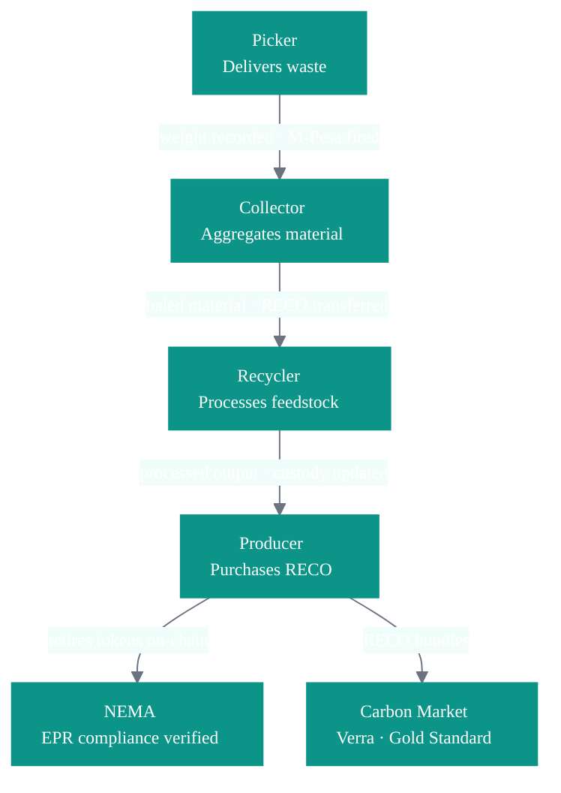
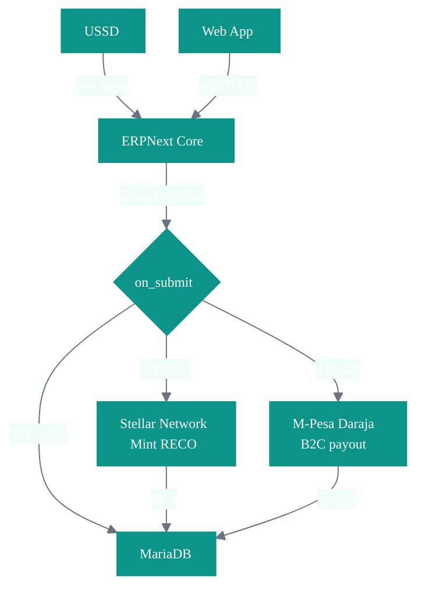
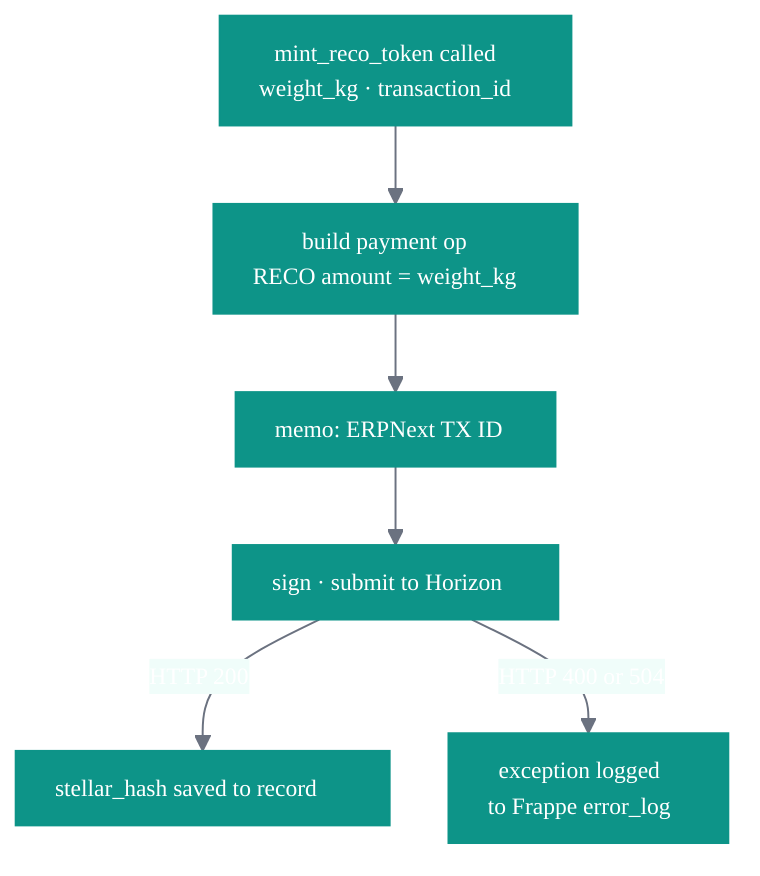
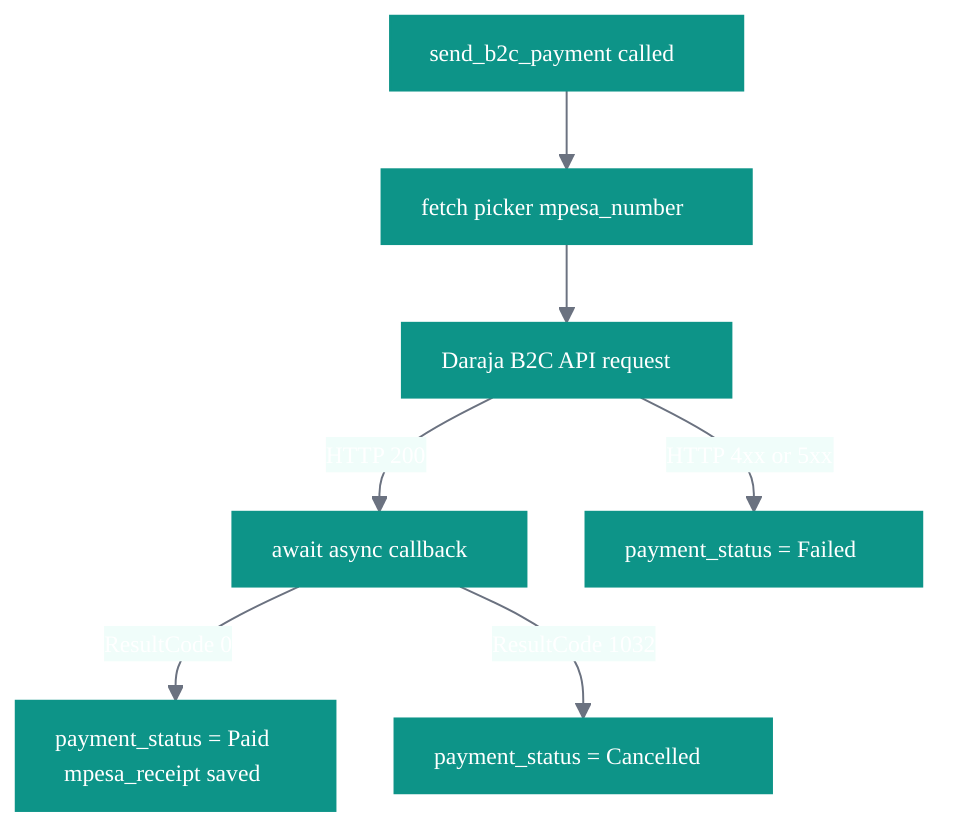
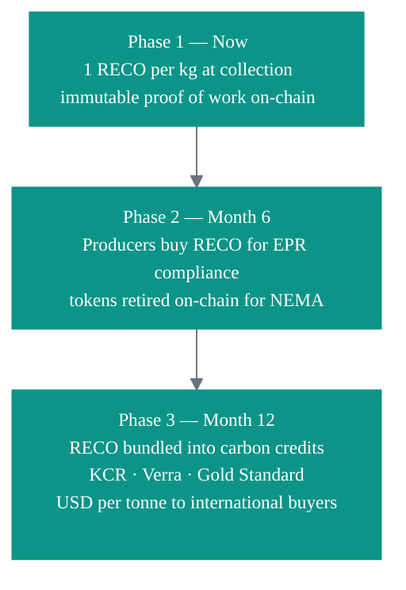

# MatXchange

MatXchange is infrastructure for the circular economy. We digitize the informal waste sector — connecting pickers, collectors, recyclers, and producers on a single verified ledger, with automatic mobile money payments and every kilogram permanently anchored to the Stellar blockchain.

**Live:** [matxchange.co.ke](https://matxchange.co.ke) &nbsp;·&nbsp; **License:** MIT

---

## Why MatXchange

Most waste management software is a database with a payment plugin. MatXchange is different because it transforms physical environmental work into a verifiable on-chain asset at the exact moment of collection.

The moat is the **RECO Token** — one token per kilogram of verified recyclable material, minted on Stellar, immutable, publicly auditable. It cannot be double-counted, faked, or manipulated.

| Stakeholder | What MatXchange delivers |
|---|---|
| Picker | Instant M-Pesa payment on submission |
| Recycler | Verified material origin with full chain of custody |
| Producer | Cryptographic EPR compliance proof via retired RECO tokens |
| Regulator | Live national diversion data |
| Carbon market | Immutable custody trail trusted by international registries |

---

## Table of Contents

- [The Value Chain](#the-value-chain)
- [System Architecture](#system-architecture)
- [Stellar Integration](#stellar-integration)
- [M-Pesa Integration](#m-pesa-integration)
- [USSD Interface](#ussd-interface)
- [RECO Token](#reco-token)
- [Live Evidence](#live-evidence)
- [Installation](#installation)
- [Configuration](#configuration)

---

## The Value Chain



---

## System Architecture



---

## Stellar Integration

**Asset:** `RECO` &nbsp;·&nbsp; **Issuer:** `GCQ5VDGZSSF6CYYBDQRX3L2NG5EDUDWIJYGTIRH4N4COXPLQNTP4KNF7` &nbsp;·&nbsp; **Denomination:** 1 RECO = 1 kg verified recyclable material

The platform account is the RECO issuer — no trustline required. Every mint carries the ERPNext transaction ID as a memo, creating a permanent two-way link between the on-chain record and the ERPNext audit log.



**Core function:** `matxchange/utils/stellar.py` → `mint_reco_token(collector_id, weight_kg, transaction_id)`

---

## M-Pesa Integration

B2C disbursement fires automatically on Waste Transaction submit. The picker's phone number is fetched from their profile — no manual steps, no delays.



**Core function:** `matxchange/utils/mpesa.py` → `send_b2c_payment(phone, amount, reference)`

---

## USSD Interface

Works on any phone. No smartphone. No internet. No app.

```
*384*13404#

1. My Earnings
2. Record Waste Sale
3. Request Payment
4. My Transactions
5. My Profile
```

Powered by Africa's Talking · `matxchange.co.ke/api/method/matxchange.utils.ussd.handler`

---

## RECO Token



---

## Live Evidence

**On-chain transactions — Stellar testnet**

| Transaction | Material | Weight | RECO | Proof |
|---|---|---|---|---|
| MATX-2026-00003 | PET Plastic | 234 kg | 234 | [stellar.expert ↗](https://stellar.expert/explorer/testnet/tx/9d9ca24cbcb336e024d7d0adcd44124aa7b9f81c6c58bfa6ed72f08565dada49) |
| MATX-2026-00005 | Metal Scrap | 56 kg | 56 | [stellar.expert ↗](https://stellar.expert/explorer/testnet/tx/b9a99562aad790d459e771008892b9cac87bf27e8c61b0663463da7f0d6ec45b) |
| MATX-2026-00006 | E-Waste | 455 kg | 455 | [stellar.expert ↗](https://stellar.expert/explorer/testnet/tx/bc80ce3dcb684716e623b03f0b2f5bfe2a6cae64c39c5eb604dc9f9393e9a7e6) |

**Payment confirmation**

```
Transaction     MATX-2026-00005
Material        Metal Scrap · 56 kg
Amount          KES 2,520
M-Pesa ref      AG_20260412_0100105613zvdxcsv5vh
Stellar hash    b9a99562aad790d459e771008892b9cac87bf27e8c61b0663463da7f0d6ec45b
Status          Paid
```

**Platform account:** [GCQ5VD...KNF7 ↗](https://stellar.expert/explorer/testnet/account/GCQ5VDGZSSF6CYYBDQRX3L2NG5EDUDWIJYGTIRH4N4COXPLQNTP4KNF7)

---

## Installation

```bash
bench init frappe-bench --frappe-branch version-16
cd frappe-bench
bench get-app erpnext --branch version-16
bench get-app https://github.com/samogera/matxchange.git
bench new-site your-site.local
bench --site your-site.local install-app erpnext
bench --site your-site.local install-app matxchange
bench start
```

---

## Configuration

Add the following keys to `sites/your-site/site_config.json`:

```json
{
  "stellar_secret_key": "",
  "stellar_network": "testnet",
  "mpesa_consumer_key": "",
  "mpesa_consumer_secret": "",
  "mpesa_shortcode": "",
  "mpesa_initiator_name": "",
  "mpesa_environment": "sandbox",
  "africas_talking_api_key": "",
  "africas_talking_username": ""
}
```

**Verify Stellar connection:**

```bash
bench --site your-site.local console
```
```python
from matxchange.utils.stellar import test_reco_mint
test_reco_mint()
```

---

<div align="center">

**MatXchange** is proprietary infrastructure developed and owned by Matxchange Ltd.

All concepts, architecture, token mechanisms, and system designs contained in this repository are the intellectual property of Matxchange Ltd and are protected under applicable intellectual property laws.

The source code is made available under the [MIT License](LICENSE) for open collaboration.<br>
The MatXchange name, RECO token concept, and circular economy operating system design are trademarks of Matxchange Ltd.

&copy; 2026 Matxchange Ltd. All rights reserved.

[matxchange.co.ke](https://matxchange.co.ke) &nbsp;·&nbsp; [samuel@matxchange.co.ke](mailto:samuel@matxchange.co.ke)

</div>
